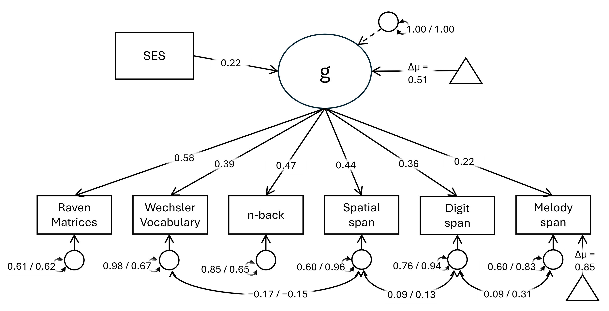
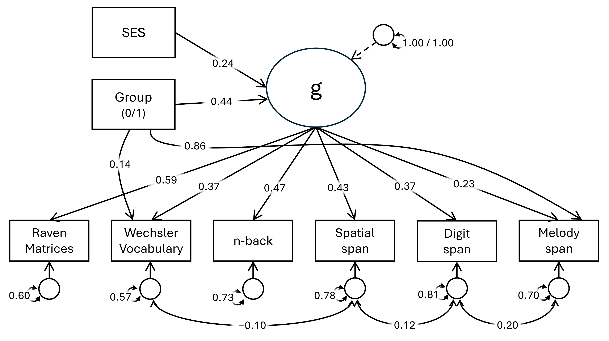

```{r setup, include=FALSE}
library(knitr)
options(knitr.kable.NA = "")
knitr::opts_chunk$set(
  echo = FALSE,
  message = FALSE,
  warning = FALSE,
  fig.align = "center",
  out.width = "92%"
)

fit_mg <- read.csv("../Tables/Table_FIT_MG.csv", check.names = FALSE)
fit_mv <- read.csv("../Tables/Table_FIT_MV.csv", check.names = FALSE)
corr_tab <- read.csv("../Tables/TableCorr.csv", row.names = 1, check.names = FALSE)

fit_mg$Description[fit_mg$Model == "ScalarPartial_1"] <- "Equal loadings and intercepts except Melody span, with equal SES -> g regression"
fit_mg$Description[fit_mg$Model == "ScalarPartial_2"] <- "ScalarPartial_1 plus equal residual covariances"
fit_mg$ModelLabel <- c(
  "Configural",
  "Metric",
  "Scalar",
  "Partial scalar",
  "Partial scalar + equal SES -> g",
  "Partial scalar + equal residual covariances",
  "Strict",
  "Equal latent means"
)
fit_mg_show <- fit_mg[, c("ModelLabel", "Description", "ChiSquare", "df", "p", "RMSEA", "CFI", "BIC", "Delta_BIC")]
names(fit_mg_show)[1] <- "Model"

fit_mv$ModelLabel <- c(
  "Latent g only",
  "Observed variables only",
  "Latent g + broad residual paths",
  "Latent g + targeted residual paths"
)
fit_mv_show <- fit_mv[, c("ModelLabel", "Description", "ChiSquare", "df", "p", "RMSEA", "CFI", "BIC", "Delta_BIC")]
names(fit_mv_show)[1] <- "Model"

sample_tab <- data.frame(
  Measure = c("Age (years)", "Years of education", "Family SES"),
  Musicians = c(22.11, 15.88, 50.06),
  Nonmusicians = c(22.15, 15.83, 44.90),
  `Cohen's d` = c(-0.01, 0.02, 0.34),
  `95% CI` = c("[-0.13, 0.10]", "[-0.09, 0.14]", "[0.22, 0.45]"),
  check.names = FALSE
)

corr_display <- corr_tab
corr_display[] <- lapply(corr_display, function(x) ifelse(x == "", "", x))

mg_key <- data.frame(
  Parameter = c(
    "Latent mean difference in g (musicians - nonmusicians)",
    "Residual mean difference in Melody span intercept",
    "Standardized SES -> g (nonmusicians)",
    "Standardized SES -> g (musicians)"
  ),
  Estimate = c(0.514, 0.851, 0.220, 0.198),
  Interpretation = c(
    "About half a latent SD",
    "Additional Melody-span advantage beyond g, in the standardized observed metric",
    "Small positive SES association with g",
    "Small positive SES association with g"
  ),
  check.names = FALSE
)

mv_key <- data.frame(
  Parameter = c(
    "Latent group effect on g",
    "Residual group effect on Wechsler Vocabulary",
    "Residual group effect on Melody span",
    "Standardized SES -> g"
  ),
  Estimate = c(0.418, 0.082, 0.430, 0.227),
  Interpretation = c(
    "Latent advantage favoring musicians",
    "Small residual task-specific difference",
    "Moderate residual task-specific difference",
    "Small positive SES association with g"
  ),
  check.names = FALSE
)
```

# Overview

This supplement documents the latent-variable reanalysis accompanying the commentary on *Do Musicians Have Better Short-Term Memory Than Nonmusicians? A Multilab Study* (Grassi et al., 2025). The goal of the reanalysis is not to dispute the original empirical pattern. Rather, it is to ask at what level that pattern is most meaningfully interpreted.

We claim that, once the observed cognitive measures are treated as indicators of a shared cognitive ability, musician versus nonmusician differences might be more parsimoniously described as a difference on a general latent factor, `g`, plus a limited amount of remaining task-specific variance.

To keep this supplement readable, we report only the information that is substantively necessary for evaluating that claim. Full raw output is intentionally omitted from the main document. The tables in the `/Tables` subfolder and the figures in the `/Figures` subfolder are used directly below.

# Data and preliminary checks

The reanalysis used the same matched sample reported in the target article, namely 600 musicians and 600 nonmusicians. Before moving to latent models, we checked the matching variables and the main covariate included in the SEMs.

```{r table-s1}
kable(
  sample_tab,
  digits = 2,
  caption = "Table S1. Preliminary group comparison for matching variables and family SES."
)
```

Age and years of education were, as intended, essentially matched across groups. By contrast, family SES was somewhat higher among musicians, with a small standardized difference, $d = 0.34$. Accordingly, SES was carried into the latent models as a covariate rather than treated as ignorable.

# Why a latent-variable reanalysis is warranted

The commentary argues that interpretation should start from the well-known tendency of cognitive measures to correlate positively (the *positive manifold* of cognitive abilities). In the present dataset, Raven, vocabulary, n-back, digit span, spatial span, and melody span all show mostly positive associations, and SES is also positively related to the cognitive indicators. In other words, the data exhibit exactly the kind of positive manifold that motivates a common-factor representation.

```{r table-s2}
kable(
  corr_display,
  align = "lccccccc",
  caption = "Table S2. Exported cross-group correlation matrix for the standardized cognitive indicators and SES. The upper and lower triangles correspond to the two groups as saved by the preprocessing script."
)
```

The correlations are not identical across groups, but they are similar enough in overall pattern to justify formal invariance testing. For the purposes of the commentary, the key implication is more basic: a task-by-task mean comparison is not the most informative starting point, because part of any observed task difference is likely to reflect shared variance across tasks.

# Modeling strategy

Two complementary SEM strategies were used.

First, we fitted a **multigroup CFA / invariance sequence**. The latent factor `g` was defined by Raven, Wechsler Vocabulary, n-back, Spatial span, Digit span, and Melody span. The latent variance of `g` was fixed to 1 in both groups. SES was specified as a predictor of `g`. Three residual covariances were included throughout: Vocabulary with Spatial span, Spatial span with Digit span, and Digit span with Melody span.

Second, because the original study was multilab and cross-national, we fitted a **multilevel SEM** with clustering by country. This model cannot reproduce the exact multigroup design simultaneously (in `lavaan`), but it provides a useful robustness test. The crucial question here was whether the group effect is best placed only on the observed variables, only on `g`, or on `g` plus a very small number of targeted residual paths.

# Multigroup CFA results

## Model comparison

```{r table-s3}
kable(
  fit_mg_show,
  digits = 3,
  caption = "Table S3. Fit indices for the multigroup CFA sequence.",
  col.names = c("Model", "Description", "$\\chi^2$", "df", "p", "RMSEA", "CFI", "BIC", "$\\Delta$BIC"),
  escape = FALSE
)
```

The multigroup results are structurally clear.

Configural and metric invariance were both acceptable, which indicates that the one-factor measurement structure is broadly similar across musicians and nonmusicians. Full scalar invariance, however, fit very poorly. This matters, because it shows that the group contrast cannot be reduced to a simple latent mean difference under fully equal intercepts.

Once the Melody-span intercept was freed, fit improved dramatically and returned to an acceptable range. Adding the equality constraint on the SES regression did not materially damage fit, and this model remained slightly cleaner than the still more constrained residual-covariance model. Although the latter had the numerically smallest BIC, the difference was trivial ($\Delta$BIC = 0.33), whereas approximate fit was somewhat worse. For interpretation, therefore, the more parsimonious **partial-scalar model with equal SES -> g regression** was retained.

Finally, when latent means were constrained equal, fit worsened again. This is the central substantive result of the multigroup analysis: after accounting for measurement structure and partial intercept noninvariance, a group difference remains at the latent-factor level.

## Preferred multigroup representation

```{r fig-s1, fig.cap="Figure S1. Preferred multigroup representation. Dual values separated by a slash denote the two groups for group-specific quantities such as residual variances or residual covariances: left values for non-musicians, right values for musicians. Triangles (representing intercepts) indicate where group differences in mean values emerged."}

```

Figure S1 and Table S4 summarize the final substantive picture. The group contrast is represented in two places. First, musicians are higher on the latent factor `g`. Second, Melody span shows a remaining indicator-specific intercept difference that is not absorbed by `g`.

```{r table-s4}
kable(
  mg_key,
  digits = 3,
  caption = "Table S4. Key estimates from the preferred multigroup model."
)
```

The latent mean difference was approximately 0.51 latent SD units. Because the latent variance of `g` was fixed to 1 in both groups, this contrast can be read directly as a difference of about half a latent standard deviation. At the same time, Melody span retained an additional intercept shift of roughly 0.85 units in the standardized observed metric. Thus, the musical-memory task is not simply another interchangeable indicator of the same group contrast, it contains an obvious residual advantage beyond the general cognitive factor.

The SES effect on `g` was small and positive in both groups, and the standardized coefficients were very similar.

## Interpretation of the multigroup findings

The broad musician advantage in the cognitive battery is largely captured by a single latent dimension. However, the failure of full scalar invariance also shows that not every group difference should be read as a pure reflection of `g`. Melody span carries additional group-related variance, which is exactly what one would expect from a task that is closest to musical expertise.

This pattern is theoretically preferable to a flat task-by-task reading. Instead of saying that musicians have separate advantages in several partially disconnected memory tasks, the latent model suggests a more parsimonious account: a general cognitive difference plus one especially salient music-specific residual deviation.

# Multilevel SEM results

## Model comparison

```{r table-s5}
kable(
  fit_mv_show,
  digits = 3,
  caption = "Table S5. Fit indices for the multilevel SEM sequence, with clustering by country.",
  col.names = c("Model", "Description", "$\\chi^2$", "df", "p", "RMSEA", "CFI", "BIC", "$\\Delta$BIC"),
  escape = FALSE
)
```

The multilevel models serve as a robustness check under a design that partly respects the clustered structure of the original dataset. The results again point to a mixed but clearly ordered solution.

A model placing the group effect only on `g` fit poorly. A model placing all group differences only at the observed-variable level fit much better. However, the best BIC was obtained by the targeted hybrid model, which combined a latent group effect on `g` with direct residual paths only to Wechsler Vocabulary and Melody span. This is exactly the pattern one would expect if the main contrast is general but not perfectly exhaustive.

## Preferred multilevel representation

```{r fig-s2, fig.cap="Figure S2. Preferred multilevel SEM representation. The sign of the raw group coefficients depends on the coding of the group variable; the diagram displays the effects in the direction favoring musicians."}

```

```{r table-s6}
kable(
  mv_key,
  digits = 3,
  caption = "Table S6. Key standardized effects from the preferred multilevel model. Absolute values are reported for ease of interpretation, because the sign depends on the chosen coding of the group variable."
)
```

In the preferred multilevel model, the group effect on `g` was substantial, about 0.42 SD in standardized terms. Beyond that latent effect, there was only a small residual path to vocabulary and a larger residual path to Melody span. SES again predicted `g` positively.

This result converges with the multigroup CFA while not being identical to it. The multilevel model still says that the main group contrast sits at the common-factor level. Yet it also suggests that a small amount of indicator-specific variance remains, concentrated especially in Melody span and, to a lesser extent, vocabulary.

# Integrative interpretation

Taken together, the two reanalyses support the same broad conclusion.

The musician versus nonmusician contrast in this battery is not best described as a collection of separate advantages in verbal, visuospatial, executive, and musical short-term memory tasks. A more coherent and parsimonious reading is that musicians differ primarily on a **general cognitive factor** defined by the shared variance among the tasks. Once this common factor is modeled, the only clearly substantial residual deviation is the expected one, namely Melody span. A smaller vocabulary-specific deviation appears in the multilevel model, but it is much weaker than the latent effect and clearly secondary to it.

# Reproducibility note

This RMarkDown output is concise and does not feature all R analyses that were performed. Also, the file reuses the precomputed tables stored in `/Tables` and the diagrams stored in `/Figures`, rather than re-running the full SEM workflow during knitting. However, the full R code for reproducibility is available via the GitHub repository: https://github.com/EnricoToffalini/musicians-commentary 

