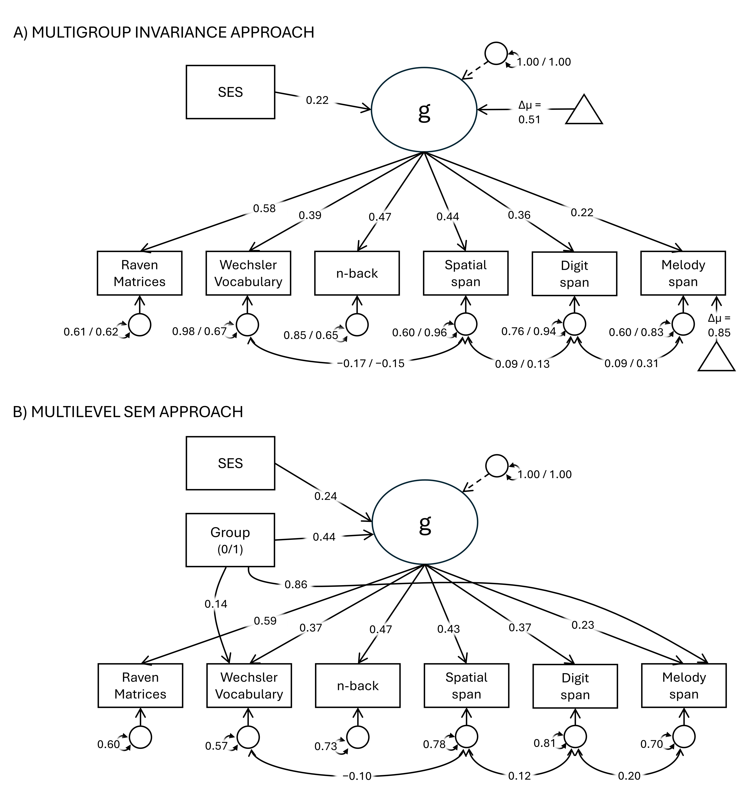

@grassiMusiciansHaveBetter2025 provide the strongest dataset to date on cognitive differences between musicians and nonmusicians. Their contribution is exemplary in scale, openness, and collaborative rigor, and shows how a literature long constrained by underpowered studies and heterogeneous protocols can be meaningfully advanced. Their core empirical contribution is not in question. Here, we focus on a more specific but theoretically important issue, that extends well beyond the present case: the level at which correlated cognitive findings can be most meaningfully interpreted.

The article aims to test whether musicians outperform nonmusicians in short-term memory. They focus not only on music/melody memory, where a large effect is unsurprising, but also on verbal and visuospatial short-term memory, where any differences were less obvious a priori. The discussion appropriately considers several hypotheses, including music-specific transfer, broader cognitive differences, and selection effects. However, its interpretation remains closer to a task-by-task reading of the cognitive results than is warranted by the broader theory of cognitive individual differences.

In intelligence research, the observation of a positive manifold across cognitive-task performances is a pivotal starting point, and mainstream psychometric accounts continue to regard the variance common to different cognitive tests as theoretically fundamental, labeling it general intelligence, general cognitive ability, or "g" [@spearman1904g; @coyleDefiningMeasuringIntelligence2021; @coyleCarbonLife_____2023]. Although the nature of "g" may remain somewhat elusive, its neurobiological and genetic roots are increasingly being recognized, suggesting that it is not just a statistical artifact [@dearyGeneticVariationBrain2022]. Latent-variable modeling remains central to mainstream psychometric theories of cognitive abilities and, more broadly, to major theories of individual differences in diverse areas like personality and clinical psychology [@wrightLatentVariableModels2020]. In all these cases, the implication is that observed tasks or items are not psychologically independent just because they look superficially different. When several indicators covary, the question is whether any group difference is expressed at the level of shared or nonshared variance, rather than whether each observed score should be treated separately as evidence for a distinct, specific difference.

Grassi et al. measured not only memory tasks but also Raven, Wechsler Vocabulary, and n-back performance. These scores were then entered into a set of separate mixed-effects models (one per short-term memory outcome) as control variables, implicitly treating them as direct causes of memory performance or, more pragmatically, as variables to be conditioned on when asking whether musicians still outperform nonmusicians at the same level of some other cognitive abilities [yet without a measurement model, this strategy carries a substantial risk of spurious conclusions, @westfallStatisticallyControllingConfounding2016]. In their discussion, the authors themselves noted that the broadly positive pattern across cognitive variables may reflect a more general cognitive advantage, with the clearest and largest difference emerging when the task is closest to musical expertise. We believe this consideration should not remain a side note, but should instead guide a more parsimonious and theoretically meaningful interpretation of the findings.

We reanalyzed the data following the mainstream view that common variance among cognitive measures (interpreted as g) should be modeled first. The cognitive tasks, however, do not appear to have been selected with an explicit measurement model in mind. We therefore fit a one-factor model to the six cognitive measures, Vocabulary, Raven, n-back, digit span, spatial span, and melody span, while allowing for a small number of residual correlations as needed to ensure good model fit. The positive manifold emerged, but was not very strong: after controlling for group, the average intercorrelation among observed scores was about .20, lower than is often observed in standard intelligence batteries. This may reflect the limited reliability of some indicators, the relatively restricted and homogeneous sample, or the fact that the battery was not originally designed as a structured psychometric measure of cognitive abilities. \textcolor{teal}{For the above reasons, "g" should be understood pragmatically in the present reanalysis: we use it to indicate the shared cognitive variance across the set of tasks, without claiming that the battery provides a comprehensive measure of general intelligence. Also, more articulated specifications such as hierarchical or bifactor models would typically be used to parse general and specific sources of covariance. However, the cognitive measures in Grassi et al. (2025) were not selected as a structured intelligence battery, so we used a one-factor model just as a parsimonious representation of shared cognitive variance. The important point here is not that the model fully captures the structure of intelligence, but that the shared variance among cognitive tasks is theoretically meaningful and should be considered when interpreting group differences.}

Musicians and nonmusicians were perfectly or nearly perfectly matched on age, sex/gender, and years of education, whereas they differed in socioeconomic status (SES), with Cohen’s d = 0.34 in favor of musicians. We therefore adjusted only for SES when testing group effects, to avoid unnecessary model complexity. It should be recognized, however, that the causal status of SES here remains unclear. Group effects were examined in two ways: first, through multigroup confirmatory factor analyses (MG-CFA) within a standard measurement-invariance framework, leading to a test of equality of the specific observed intercepts and of the latent mean of g. Second, via multilevel structural equation models (SEM), in which group predicted common versus task-specific variance, while country-level clustering was accounted for through random intercepts on the observed variables. Because `lavaan` did not allow simultaneous multigroup and multilevel estimation in this case, and we chose to stick to a fully open-source analytical workflow, these approaches had to be implemented separately. SES was included as a covariate when testing group effects. Model fit was evaluated using RMSEA, CFI, and BIC. Final interpretation privileged models that combined parsimony (lowest BIC) with acceptable fit (RMSEA \< 0.05, CFI \> 0.95). For continuous predictors, effects are described using standardized coefficients. For musician-nonmusician contrasts, effects are instead described as standardized differences between groups, that is, as differences expressed in standard-deviation units of the outcome. Statistical significance was considered at the $\alpha$ = .05 level. All latent-variable models were fitted in R using the `lavaan` package [@rosseel2012lavaan].

The multigroup invariance analyses supported configural invariance, RMSEA = .027 and CFI = .986, and metric invariance, RMSEA = .029 and CFI = .979, with BIC improving from 19525.72 to 19493.60. Full scalar invariance fit poorly, but partial scalar invariance was supported once the intercept of Melody span was freed, RMSEA = .035, CFI = .966, BIC = 19478.61. Adding the equality constraint on the SES -\> g regression did not materially worsen fit, RMSEA = .035, CFI = .966, BIC = 19472.67, and this was retained as the final preferred multigroup representation (see Figure 1A). A still more constrained model with equal residual covariances yielded a trivially smaller BIC (19472.34) but worse approximate fit, RMSEA = .044 and CFI = .940, so it was not preferred for final interpretation. By contrast, strict invariance was not supported, RMSEA = .062, CFI = .871, BIC = 19501.56. Constraining the latent mean of g to equality also worsened fit, RMSEA = .057, CFI = .904, BIC = 19509.60, indicating that the groups differed at the latent level. In the preferred partial-scalar model, the estimated latent mean difference was 0.51 standard deviations in favor of musicians. Thus, the multigroup results support a parsimonious account in which musician status is associated primarily with higher general cognitive variance, while Melody span also shows clear intercept noninvariance, consistent with an additional task-specific advantage. SES positively predicted g in both groups, with very similar standardized coefficients, about .22 in nonmusicians and .20 in musicians (Figure 1A).

```{r fig-1, fig.cap="Final models representations. Panel A presents the preferred multigroup invariance model; dual values separated by a slash refer to nonmusicians and musicians, respectively. Panel B presents the preferred multilevel SEM with country-level clustering; group paths are shown in the direction favoring musicians. In both panels, rectangles denote observed variables, circles indicate latent variables, triangles mark estimated group differences in means or intercepts. All reported coefficients are statistically significant with p < 0.05. SES = Socio-Economic Status."}
#| out-width: "100%"

```

The multilevel SEM reanalysis pointed in the same general direction (see Figure 1B). At the within-country level, which is the only level we interpreted substantively, the final best fitting model included a direct effect of group on g, plus direct residual paths to Melody span and, to a minor extent, to Wechsler Vocabulary, RMSEA = .027, CFI = .979, BIC = 19133.55. Musician status predicted higher scores on latent g, corresponding to a standardized group difference of about 0.44 standard deviations on the latent factor. SES also positively predicted latent g, with a standardized coefficient of about .23. Beyond this general effect, the model suggested a large residual group difference for Melody span, about 0.86 standard deviations, and a small residual group difference for Wechsler Vocabulary, about 0.14 standard deviations.

Both our reanalyses suggest that, \textcolor{teal}{under a latent-variable representation,} the musician advantage is mostly expressed at the \textcolor{teal}{level of shared cognitive variance} (even after controlling for SES), with a clear additional specific advantage on Melody span, and a possible smaller residual \textcolor{teal}{advantage} on Vocabulary. This is not a denial of the original findings, but provides a \textcolor{teal}{plausible and} more parsimonious account within a methodological framework that is \textcolor{teal}{closely} aligned with \textcolor{teal}{mainstream psychometric thinking} on individual differences in cognitive abilities. \textcolor{teal}{Importantly, conditioning on observed cognitive scores and modeling their shared latent structure answer different inferential questions: both can be useful, but their analytical choices are not theory-neutral. Observed-score adjustment does not by itself establish that a remaining association is task-specific if, as is generally expected, observed scores contain task-specific variance, shared cognitive variance, and measurement error (e.g., Westfall \& Yarkoni, 2016). In any case, the positive manifold among cognitive tasks calls for an interpretation. A common-causes account ("g") is a parsimonious interpretation; a genuinely alternative account would need to explain the covariance pattern differently, for example through bi-directional, network-like dependencies among abilities. This is legitimate, but it should be made explicit as a theoretical approach rather than treated as a purely statistical adjustment choice} [@vandermaasDynamicalModelGeneral2006]. Thus, the point is not just to adjudicate between “significant” and “nonsignificant” group differences, but to clarify the explanatory framework: whether a set of observed scores should be interpreted as a collection of separate outcomes, with their covariance treated as a nuisance to be removed through pragmatic analytic choices, or whether the overall pattern is \textcolor{teal}{more parsimoniously interpreted as reflecting shared cognitive variance within this set of tasks.}

This matters beyond the present article. Large collaborative datasets are a major advance for the field, and their value can be strengthened even further when they are paired with designs that more fully reflect the hierarchical structure of cognitive abilities [@mcgrewCHCTheoryHuman2009]. When indicators present a positive manifold, modeling them jointly can help reveal whether apparently distinct group differences are better interpreted as manifestations of a broader common factor. Therefore, advances in data collection and research practices can and should be matched by \textcolor{teal}{careful} measurement modeling, yielding interpretations that are both more integrated and more theoretically meaningful.

# Supplemental materials and online resources

Additional material containing methodological details, model specifications and fit tables are available in the Supplementary document.

All R code and project files needed to reproduce the present analyses are available at <https://github.com/EnricoToffalini/musicians-commentary> and are archived in Zenodo at <https://doi.org/10.5281/zenodo.19626948> The reanalysis uses the public dataset released with @grassiMusiciansHaveBetter2025, which should be cited as the original data source.

\newpage

# References

::: {#refs}
:::
